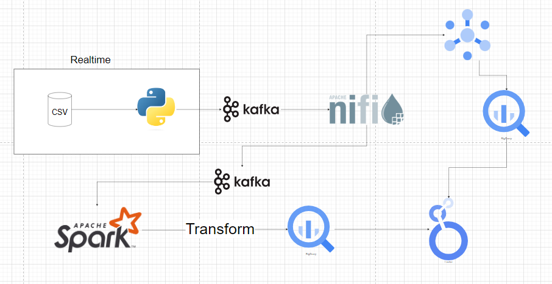
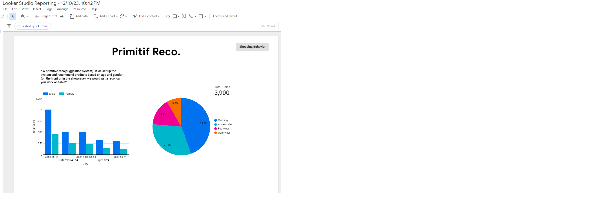
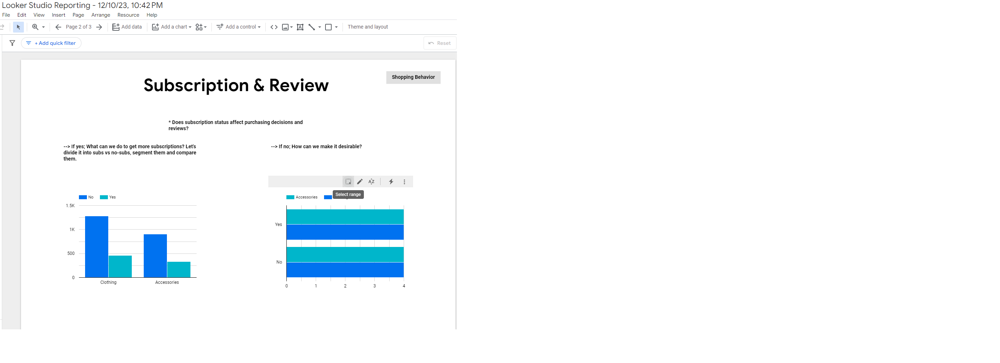
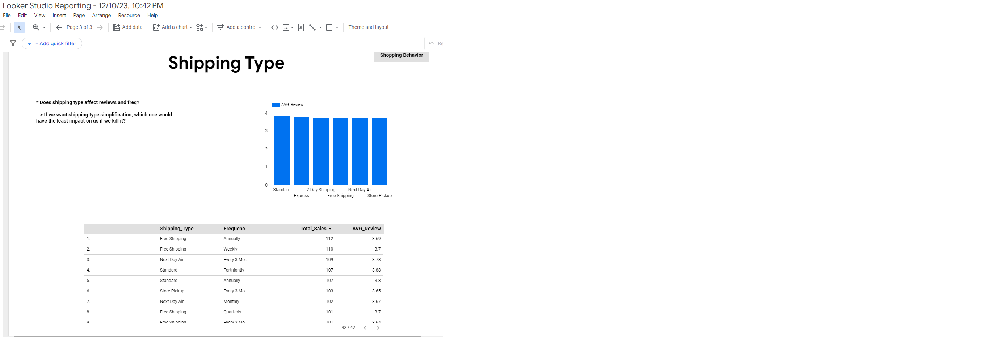

# Streaming Data

**Realtime Data**

Since the data we have does not come through a web service, I used the {csv_realtime.py} file to make our csv data behave like instantaneous data flowing through Python.

**Google Cloud**

We create a machine for ourselves using the compute engine tool on Google Cloud. The main purpose here is to continue our operations not from our own computer, but from the computer we rented from Google. We are using SSH platform here.

**Docker**

We need to start Docker on this PC with SSH. We will run Kafka and Nifi with our containers via Docker.

sudo apt update
sudo apt upgrade
sudo apt install docker.io
sudo apt install docker-compose
nano docker-compose.yml --> This will be the area where we define the docker.compose.yml file.
sudo docker-compose up -d

Then we can access kafka and nifi.

**Nifi**

Here, we pulled our data coming from Python from Kafka. We converted it to Json format, gave it the filtering we wanted, and sent it to Google Cloud as a Json file.

**Kafka**

I created a test-run file. It converts my data to json.

**Spark**

pyspark --packages org.apache.spark:spark-sql-kafka-0.10_2:12:3.1.2 --jars=gs://spark-lib/bigquery/spark-bigquery-latest_2.12.jar

I define kafka and bigquery to pyspark in hive environment.

We make uploads that are suitable for our data. We use from json to read the data coming from Kafka.

{spark_kafka_bg}I'm putting our file here.

**Bigquery**

I create my schemas in the table under the database I created, their data types must be the same as the types I took from my CSV data and defined in the {spark_kafka_bg} file.

The remaining operations are SQL queries

**Looker**

I visualize the queries I make in BigQuery on Looker.

